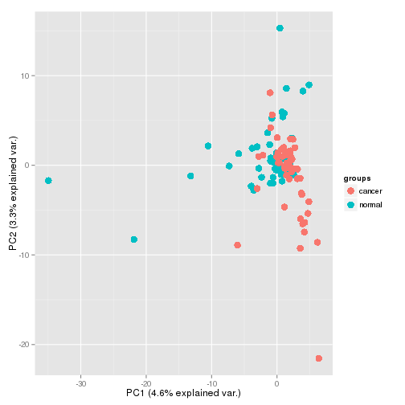
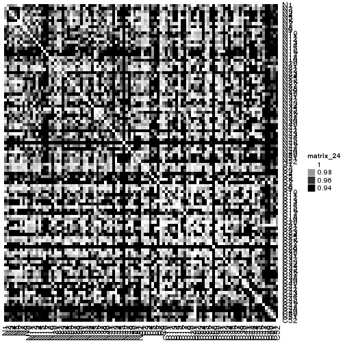
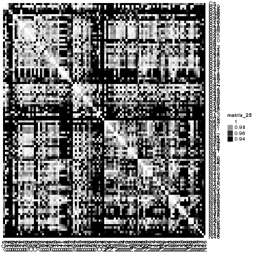
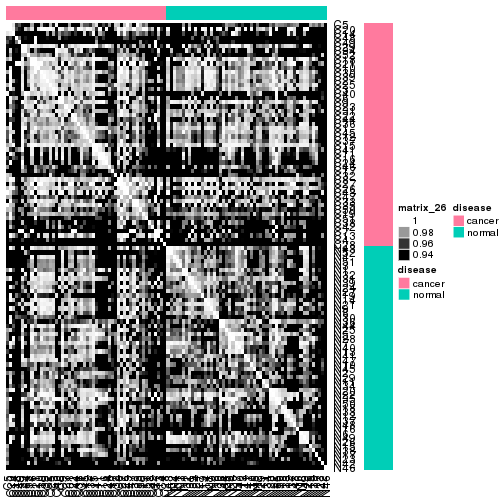
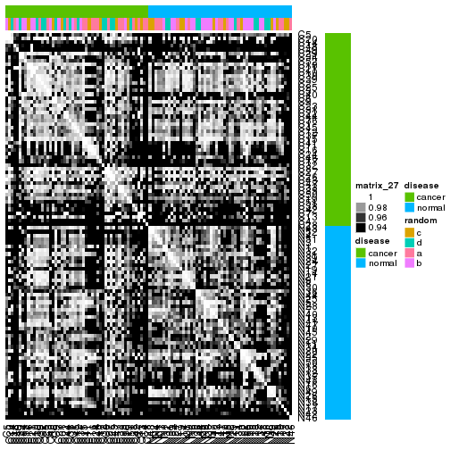

# Visualization Quality Control

Set of useful functions for calculating various measures from data and visualizing them.

## Installation

### Dependencies

Note that before installing, you will want to install the `ggbiplot` package, and at least `v1.2.1` of the `ComplexHeatmap` package. Robert M Flight maintains a fork of `ggbiplot` on GitHub because it is not part of CRAN, and as of July 2, 2015, `ComplexHeatmap` must be installed from GitHub:

```r
devtools::install_github("rmflight/ggbiplot")
devtools::install_github("jokergoo/ComplexHeatmap")
```

Other odd dependencies that may not be present include the `dendsort` package:

```r
install.packages("dendsort")
```

### This Package

This package can be installed by cloning from the GitLab repo:

```r
git clone https://gitlab.cesb.uky.edu/rmflight/visualizationQualityControl.git
cd visualizationQualityControl
R
devtools::install()
```

## Principal Components & Heatmaps

The most common application of this package is to generate principal components biplots and correlation heatmaps from high-throughput data. We will use a sample data set of exosome lipids with two classes, cancer and normal.


```r
library(visualizationQualityControl)
data(all_intensity)
data(all_info)
```


### Principal Components

Principal components analysis helps to determine if the biological condition is the primary source of variance, or if it is something else.


```r
int_zero <- all_intensity
int_zero[is.na(int_zero)] <- 0
has_3 <- apply(int_zero, 1, function(x){sum(x != 0) >= 2})
int_zero <- int_zero[has_3,]
all_pca <- prcomp(t(int_zero), center = TRUE, scale. = TRUE)
```


```r
visqc_pca(all_pca, groups = all_info$disease)
```

 

### Heatmaps

Sample-sample pairwise correlation heatmaps are useful for sample quality control, in that we expect that like samples should have higher correlations than unlike samples. If there are samples that have off group high correlations, or within group low correlations, there may be issues with quality control that need to be investigated.

First we need to calculate all of the pairwise sample-sample correlations using `pairwise_correlation`.


```r
all_cor <- pairwise_correlation(t(all_intensity))
dim(all_cor)
```

```
## [1] 104 104
```

Two things to note about this:

  1. The `t()` function call, as `pairwise_correlations` works on the rows of the data matrix. Therefore, we need to transpose the data matrix first. Here we can see that we definitely did the right thing because the correlation matrix is 104 by 104, which is equal to the number of columns (samples) in the data matrix (104).
  2. The function only calculates correlations on those things that are in common between the two samples. If the `exclude_0` argument is set to `TRUE`, then zero's will also be removed.
  

```r
library(circlize)
colormap <- colorRamp2(c(0.95, 1), c("black", "white"))
visqc_heatmap(all_cor, colormap)
```

 

This is hard to see much, maybe we can clean it up a little bit using a couple of things. One is performing clustering on sub-pieces of the correlation matrix that correspond to different classes, and re-ordering the leaves.


```r
all_order <- similarity_reorderbyclass(all_cor, all_info[, "disease", drop = FALSE], transform = "sub_1")
visqc_heatmap(all_cor, colormap, row_order = all_order$indices, column_order = all_order$indices)
```

 

Couple of things to note about the call to `similarity_reorderbyclass`:

  1. the `sample_classes` input should be either a `data.frame` or a `factor`, or NULL. Therefore, we make sure to use `drop = FALSE` when we subset to a single part of the `data.frame`.
  2. we apply a transformation to the data, because we want to have a `distance` type matrix in the similarity reordering, and for *distances* smaller values are better, therefore we apply the subtract from 1 (`sub_1`) transformation.


Finally, wouldn't it be nice to have the class of sample displayed as a legend on the heatmap?


```r
color_legend <- generate_group_colors(2)
names(color_legend) <- c("normal", "cancer")

row_data <- all_info[, "disease", drop = FALSE]
row_annotation <- list(disease = color_legend)
visqc_heatmap(all_cor, colormap, row_color_data = row_data, row_color_list = row_annotation, col_color_data = row_data, col_color_list = row_annotation, row_order = all_order$indices, column_order = all_order$indices)
```

 

We can add multiple color legends by having multiple columns in the data.frame, and multiple lists:


```r
all_info$random
```

```
##   [1] "b" "b" "a" "a" "b" "d" "b" "b" "a" "c" "d" "d" "b" "c" "c" "d" "a"
##  [18] "b" "c" "c" "b" "b" "c" "b" "b" "b" "a" "b" "b" "b" "d" "d" "d" "a"
##  [35] "b" "d" "b" "a" "b" "c" "a" "c" "c" "d" "a" "a" "a" "b" "c" "b" "a"
##  [52] "c" "b" "d" "a" "a" "b" "c" "a" "d" "d" "b" "c" "d" "c" "d" "a" "a"
##  [69] "c" "c" "c" "c" "b" "d" "b" "a" "d" "d" "a" "a" "d" "d" "c" "d" "a"
##  [86] "b" "a" "d" "b" "a" "a" "b" "a" "c" "d" "a" "a" "a" "c" "a" "b" "b"
## [103] "d" "b"
```

```r
color_legend <- generate_group_colors(6)
names(color_legend) <- c(unique(all_info$random), unique(all_info$disease))

col_data <- all_info
col_annotation <- list(random = color_legend[1:4], disease = color_legend[5:6])

row_data <- all_info[, "disease", drop = FALSE]
row_annotation <- list(disease = color_legend[5:6])
visqc_heatmap(all_cor, colormap, row_color_data = row_data, row_color_list = row_annotation, col_color_data = col_data, col_color_list = col_annotation, row_order = all_order$indices, column_order = all_order$indices)
```

 

