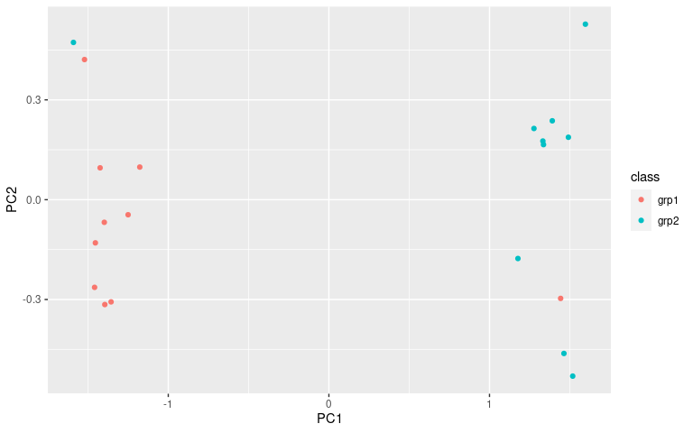
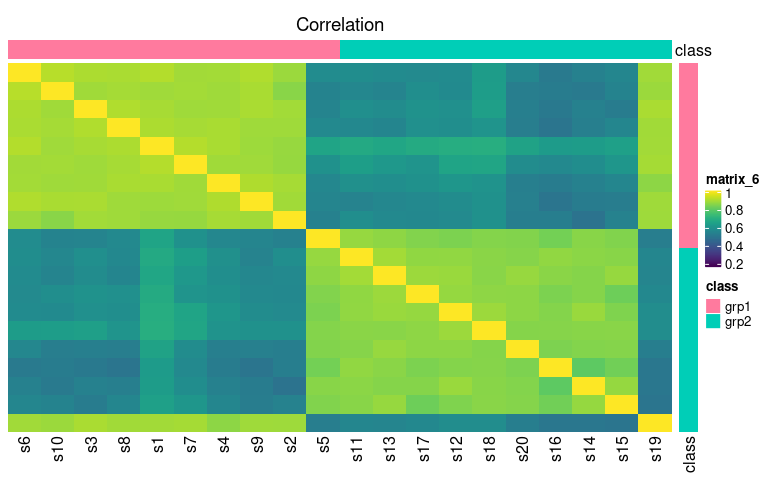
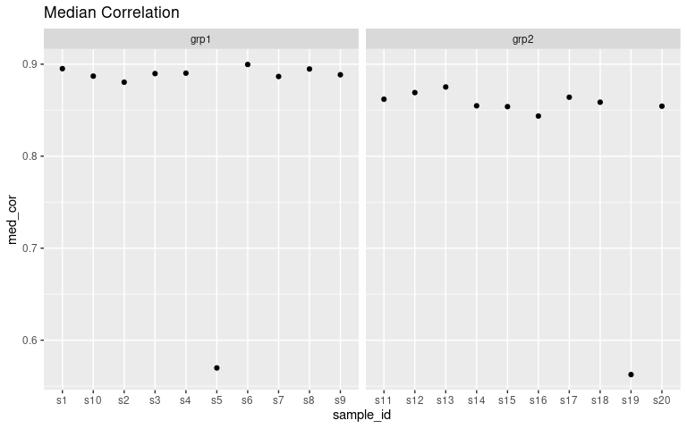
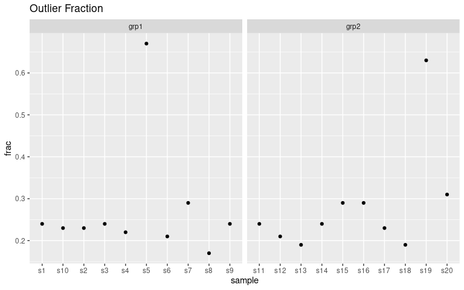

Visualization Quality Control
=============================

Set of useful functions for calculating various measures from data and
visualizing them.

Takes a lot of inspiration from [Gierlinski et al.,
2015](https://dx.doi.org/10.1093/bioinformatics/btv425), especially the
`median_correlation` and `outlier_fraction` functions.

This **readme** is documenting functionality as of **818b62f8**.

Installation
------------

### Dependencies

Note that before installing, you will want to install the `ggbiplot`
package, and at least `v1.2.1` of the `ComplexHeatmap` package. Robert M
Flight maintains a fork of `ggbiplot` on GitHub because it is not part
of CRAN, and as of July 2, 2015, `ComplexHeatmap` must be installed from
GitHub:

    devtools::install_github("rmflight/ggbiplot")
    devtools::install_github("jokergoo/ComplexHeatmap")

Other odd dependencies that may not be present include the `dendsort`
package, and the `viridis` package:

    install.packages("dendsort")
    install.packages("viridis")

### This Package

This package can be installed by cloning from the GitLab repo:

    git clone https://gitlab.cesb.uky.edu/rmflight/visualizationQualityControl.git
    cd visualizationQualityControl
    R
    devtools::install(".", quick = FALSE) # builds the vignette, which you definitely want

Alternatively, you can install it from GitHub in one go:

    devtools::install_github("rmflight/visualizationQualityControl", quick = FALSE)

Examples
--------

These examples show the primary functionality. We will apply the
visualizations to a two group dataset. However, all of the functions are
still applicable to datasets with more than two groups. The examples
below are for a dataset where there has been a sample swapped between
the two groups (i.e. there is a problem!). If you want to see how the
visualizations compare between a **good** dataset and a **bad** dataset,
see the vignette.

    library(visualizationQualityControl)
    data("grp_cor_data")
    exp_data <- grp_cor_data$data
    rownames(exp_data) <- paste0("f", seq(1, nrow(exp_data)))
    colnames(exp_data) <- paste0("s", seq(1, ncol(exp_data)))

    sample_info <- data.frame(id = colnames(exp_data), class = grp_cor_data$class)

    exp_data[, 5] <- grp_cor_data$data[, 19]
    exp_data[, 19] <- grp_cor_data$data[, 5]
    sample_classes <- sample_info$class

### visqc\_pca

    pca_data <- prcomp(t(exp_data), center = TRUE)
    visqc_pca(pca_data, groups = sample_classes)

<!-- -->

### visqc\_heatmap

Calculate sample-sample correlations and reorder based on within class
correlations

    data_cor <- pairwise_correlation(t(exp_data), exclude_0 = TRUE)$cor
    data_order <- similarity_reorderbyclass(data_cor, sample_classes, transform = "sub_1")

And then generate a colormapping for the sample classes and plot the
correlation heatmap.

    data_legend <- generate_group_colors(2)
    names(data_legend) <- c("grp1", "grp2")
    row_data <- sample_info[, "class", drop = FALSE]
    row_annotation <- list(class = data_legend)

    library(viridis)
    library(circlize)
    colormap <- colorRamp2(seq(0.4, 1, length.out = 20), viridis::viridis(20))

    visqc_heatmap(data_cor, colormap, "Correlation", row_color_data = row_data,
                  row_color_list = row_annotation, col_color_data = row_data,
                  col_color_list = row_annotation, row_order = data_order$indices,
                  column_order = data_order$indices)

<!-- -->

### median\_correlations

    data_medcor <- median_correlations(data_cor, sample_classes)
    ggplot(data_medcor, aes(x = sample_id, y = med_cor)) + geom_point() + 
      facet_grid(. ~ sample_class, scales = "free") + ggtitle("Median Correlation")

<!-- -->

### outlier\_fraction

    data_outlier <- outlier_fraction(t(exp_data), sample_classes)
    ggplot(data_outlier, aes(x = sample, y = frac)) + geom_point() + 
      facet_grid(. ~ class, scales = "free") + ggtitle("Outlier Fraction")

<!-- -->

Open Vignette
-------------

To open the vignette giving an example of examining data for quality
control purposes, you should see the `quality_control` vignette using:

    vignette("quality_control", package = "visualizationQualityControl")

This will open the vignette in the help pane in `RStudio`, which is
often what you want to happen.

Fake Data Generation
--------------------

Some fake data is stored in `grp_cor_data` that is useful for testing
the `median_correlation` function. It was generated by:

    library(fakeDataWithError)
    set.seed(1234)

    s1 <- runif(100, 0, 1)
    grp1 <- add_uniform_noise(10, s1, 0.1)

    model_data <- data.frame(s1 = s1, s2 = grp1[, 1])

    lm_1 <- lm(s1 ~ s2, data = model_data)

    lm_1$coefficients[2] <- 0.5

    s3 <- predict(lm_1)
    s4 <- add_uniform_noise(1, s3, 0.2)

    grp2 <- add_uniform_noise(10, s4, 0.1)

    grp_class <- rep(c("grp1", "grp2"), each = 10)

    grp_cor_data <- list(data = cbind(grp1, grp2), class = grp_class)

    library(fakeDataWithError)
    set.seed(1234)

    n_point <- 1000
    n_rep <- 10

    # a nice log-normal distribution of points with points along the entire range
    simulated_data <- c(rlnorm(n_point / 2, meanlog = 1, sdlog = 1),
                        runif(n_point / 2, 5, 100))

    # go to log to have decent correlations on the "transformed" data
    lsim1 <- log(simulated_data)

    # add some uniform noise to get lower than 1 correlations
    lgrp1 <- add_uniform_noise(n_rep, lsim1, .5)

    # add some uniform noise to everything in normal space
    sim1_error <- add_uniform_noise(n_rep, simulated_data, 1, use_zero = TRUE)
    # and generate the grp1 data in normal space
    ngrp1 <- exp(lgrp1) + sim1_error

    # do regression to generate some other data
    model_data <- data.frame(lsim1 = lsim1, lsim2 = lgrp1[, 1])
    lm_1 <- lm(lsim1 ~ lsim2, data = model_data)

    # reduce the correlation between them
    lm_1$coefficients[2] <- 0.5
    lsim3 <- predict(lm_1)

    # and a bunch of error
    lsim4 <- add_uniform_noise(1, lsim3, 1.5)

    # create group with added error to reduce correlation from 1
    lgrp2 <- add_uniform_noise(10, lsim4, .5)

    # add error in original space
    nsim4 <- exp(lsim4)
    sim4_error <- add_uniform_noise(10, nsim4, 1, use_zero = TRUE)
    ngrp2 <- exp(lgrp2) + sim4_error

    # put all data together, and make negatives zero
    all_data <- cbind(ngrp1, ngrp2)
    all_data[(all_data < 0)] <- 0

    grp_class <- rep(c("grp1", "grp2"), each = 10)

    grp_exp_data <- list(data = all_data, class = grp_class)
